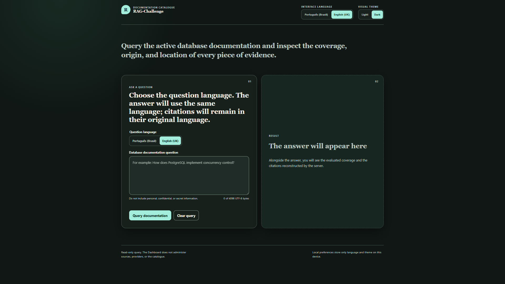
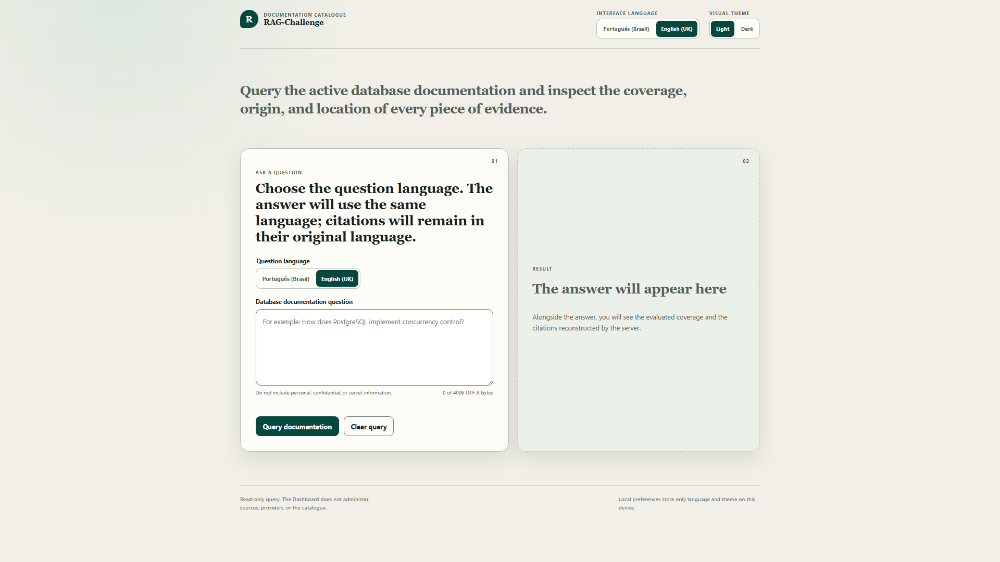
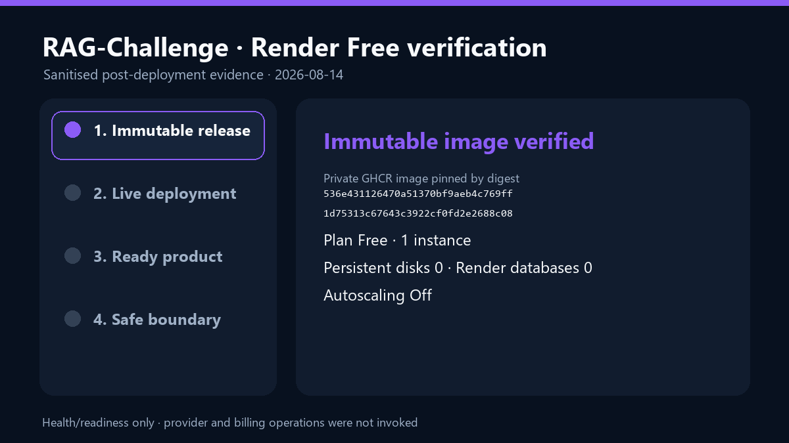
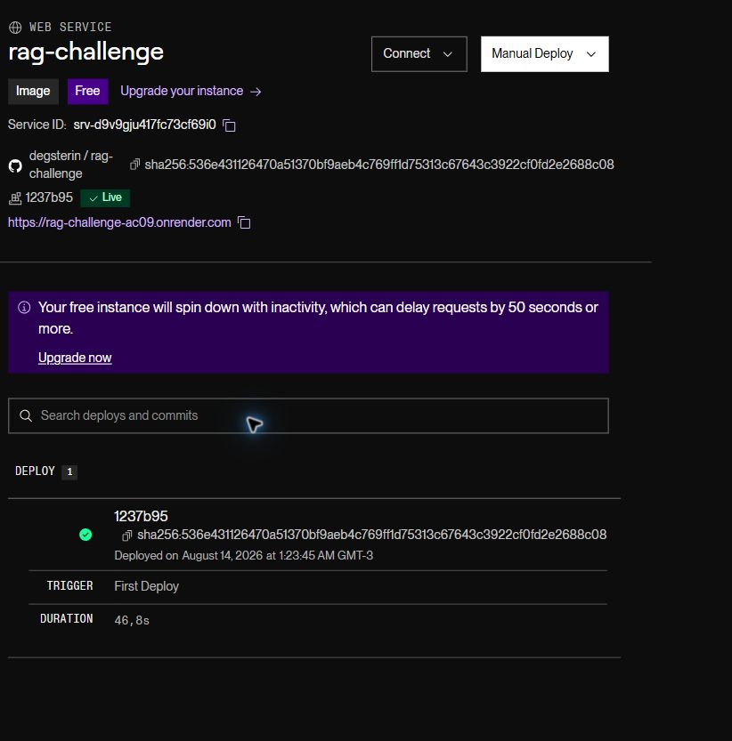

# RAG-Challenge

## Latest screenshots




Independent RAG assistant for querying database documentation in natural
language, with grounded answers and source references.

> Status on 2026-08-14: `STATE-07 TESTING_HOMOLOGATION` is active. The local
> product has PostgreSQL 18.4 `LocalAuthorised` materialised and the text-first
> generation
> `idxgen-ec39244b021c90fceea1b3a628fe793a99f74650cad451f16ffbcd414af636f6`
> activated at revision `1`, with 3,282 chunks, 3,282 vectors and
> `renderManifestId=null`. The private image was published to GitHub Container
> Registry and deployed once to a Render Web Service Free. The public health
> and readiness endpoints confirm the `Live` service, active generation and
> PostgreSQL 18.4 catalogue. No product query, Responses call or new embedding
> request was made during deployment. This is `STATE-07` homologation evidence,
> not production homologation or automatic replacement of the accepted OCI
> target.

## Online demonstration

[Open RAG-Challenge on Render](https://rag-challenge-ac09.onrender.com).
The Free instance may sleep after inactivity; the first load may take 50
seconds or more.



| Check | Result observed on 2026-08-14 |
|---|---|
| Plan and resources | Render Hobby, Web Service `Free`, one instance, autoscaling disabled, zero persistent disks and zero Render databases |
| Private image | `ghcr.io/degsterin/rag-challenge@sha256:536e431126470a51370bf9aeb4c769ff1d75313c67643c3922cf0fd2e2688c08` |
| Liveness | [`GET /api/v1/health/live`](https://rag-challenge-ac09.onrender.com/api/v1/health/live) returned HTTP `200` and `Live` |
| Readiness | [`GET /api/v1/health/ready`](https://rag-challenge-ac09.onrender.com/api/v1/health/ready) returned HTTP `200` and `Ready` |
| Loaded product | one active database, one eligible document, zero degraded documents and revision `postgresql-18.4-product-v1` |
| Active generation | `idxgen-ec39244b021c90fceea1b3a628fe793a99f74650cad451f16ffbcd414af636f6` |
| Observed Render cost | services, monthly total and forecast at `USD 0.00`; no card registered |
| Evidence boundary | no product question, Responses call or embedding request was made during the public check |



The two endpoints above are the safe way to check availability without asking
a question or consuming the provider. In PowerShell:

```powershell
Invoke-RestMethod https://rag-challenge-ac09.onrender.com/api/v1/health/live
Invoke-RestMethod https://rag-challenge-ac09.onrender.com/api/v1/health/ready
```

The Free instance filesystem is ephemeral. The activated store is restored
from a private seed and verified at every boot; answer evidence created after
start-up is discarded on restart, redeploy or spin-down. The provider key
remains only as a Render secret, and its use is billed independently from
hosting.

## Problem

Technical documentation is often distributed across long files and different
sources. RAG-Challenge aims to reduce search time through a question-and-answer
interface that retrieves relevant passages before asking the language model
for an answer.

The product is independent by design to satisfy the Alura/ONE Challenge.
The architecture preserves conceptual and technological compatibility with
DB-Notifier for possible future integration without creating a dependency
between the repositories. RAG-Challenge will own the public OpenAPI contract;
the future consuming adapter will belong to DB-Notifier and that repository's
gates.

## MVP scope

The first functional product must:

- maintain the initial canonical catalogue of 51 databases, with many-to-many
  categories and no hard-coded product list;
- allow an administrator to add, version, activate, deactivate and logically
  remove databases and any number of associated PDF/CSV documents;
- require at least one active, validated document for every active database;
- manually synchronise allowlisted official sources into versioned snapshots
  and ingest authorised local documents under the same governance;
- search all active documents in one retrieval space by default, preserving
  `LocalAuthorised` or `OfficialExternal` origin in citations;
- use dedicated PDF and CSV adapters without coupling the core to parsers;
- preserve immutable, reopenable bytes for rebuild and rollback;
- split, vectorise and index content with versioned strategies;
- answer questions using only retrieved evidence;
- accept questions in `pt-BR` and `en-GB` and answer in the declared question
  language;
- allow the interface to switch between `pt-BR` and `en-GB`, independently of
  the question language;
- allow the interface theme to switch between `Light` and `Dark`, independently
  of the visual and query languages;
- present the document and location used in the answer;
- preserve the source content's original language in citations;
- declare insufficient evidence when the corpus does not support the answer;
- support document versioning, candidate-index construction and safe
  activation without making partial staging queryable;
- run on the local computer;
- be publishable on OCI with verifiable evidence;
- include tests, secure configuration and operating documentation; and
- publish a versioned RAG-Challenge-owned OpenAPI v1 contract.

The Dashboard implements visual language, theme and query language as
independent selections. The eight `pt-BR`/`en-GB` and `Light`/`Dark`
combinations have local synthetic evidence from the frontend-owning state;
this does not constitute product homologation with a real corpus or providers.

The reference corpus supplied by the course is not used automatically: it
remains in `reference-materials/`, outside Git. Before any product activation,
the owner must provide or authorise a corpus with verified usage rights,
provenance and language.

## Outside the MVP

- multiple active corpora at the same time;
- scheduled incremental synchronisation;
- generic crawling or a user-provided URL;
- unrestricted internet browsing during a question;
- document formats beyond PDF and CSV;
- dynamic plug-in loading;
- multiple active embedding, vector or model providers;
- corporate authentication, complete RBAC and multi-tenancy; and
- executable integration with DB-Notifier.

Contracts and boundaries anticipate these capabilities, but they will not be
implemented prematurely.

## Accepted bootstrap architecture

```text
Browser
   |
   v
RAG-Challenge Dashboard
   |
   v
RAG-Challenge API
   |
   v
Application use cases
   |
   +--> local document source --> immutable content store --> parser --> chunker
   |
   +--> allowlisted official source --> governed snapshot/content --> parser --> chunker
   |
   +--> embedding provider --> vector store
   |
   +--> retriever --> language model --> answer with citations
```

Dependencies point towards the core:

```text
RagChallenge.Domain
        ^
        |
RagChallenge.Application
(includes RAG abstractions)
        ^
        |
Infrastructure / Persistence / API

Dashboard -- versioned HTTP --> API
```

The detailed design is in
[`Solution-Architecture-Document.md`](prompts/foundation/Solution-Architecture-Document.md),
and the RAG-specific rules are in
[`RAG-Module.md`](prompts/foundation/RAG-Module.md).

## Local operation, GitHub and hosting

The pinned toolchains, governed restores and complete checks are documented in
[`PROJECT-SETUP.md`](docs/PROJECT-SETUP.md). A missing cache does not authorise
a network fallback.

With dependencies already restored, run the local integrated example from the
repository root:

```powershell
./src/RagChallenge.Server.Api/Build-IntegrationArtifact.ps1
./src/RagChallenge.Server.Api/Test-IntegrationArtifact.ps1
```

The sanitised result verified in `STATE-06` contains:

```json
{
  "Status": "Passed",
  "DashboardServed": true,
  "AnswerLanguages": ["en-GB", "pt-BR"],
  "RestartPreservedGeneration": true,
  "ControlStore": "control.db",
  "VectorStore": "vectors.db"
}
```

This example uses only a synthetic CSV fixture, deterministic providers,
temporary SQLite stores and a Windows loopback listener. It demonstrates the
integrated local flow and reopening the same generation after restart; it does
not claim a real corpus, provider or official source, Linux execution, OCI,
production support or deployment.

The separate Linux ARM64 packaging rehearsal can also be built and checked
statically without a restore:

```powershell
./src/RagChallenge.Server.Api/Build-OciRehearsalArtifact.ps1
./src/RagChallenge.Server.Api/Test-OciRehearsalArtifact.ps1
```

The checker validates the manifest, hashes, fail-closed configuration and ELF
AArch64 identity. The ARM64 binary is not run on Windows, and no OCI operation
is performed. The plan and limitations are in
[`STATE-06-OCI-Readiness-And-Rehearsal.md`](docs/STATE-06-OCI-Readiness-And-Rehearsal.md).

The Render Hobby/Free package prepares a private image with the activated
PostgreSQL snapshot and restores a verified ephemeral store at every boot. The
PDF and store remain outside public Git; the image containing the seed remains
private in GHCR:

```powershell
./eng/Build-RenderFreePackage.ps1
./eng/Test-RenderFreePackage.ps1
```

The procedure, persistence limitations, private publication and deployment
evidence are in
[`deploy/render-free/README.md`](deploy/render-free/README.md). The Render
deployment is a public homologation demonstration. It does not silently
replace the OCI requirement recorded in the Challenge materials; final
selection of the production target requires its own architectural
reconciliation.

The code may be hosted in a public GitHub repository. GitHub Pages alone hosts
only static content: it neither runs the RAG backend nor protects model
credentials. Online delivery must run the backend in an authorised OCI
service. A static interface on GitHub Pages may be assessed later if it uses a
separately published secure API; it does not replace the OCI requirement.

## Known delivery requirements

The local Challenge materials define the minimum result as:

- a public, organised GitHub repository with commit history;
- a functional agent based on at least one document;
- a README covering vision, architecture, technologies, operation and
  examples;
- use of at least one OCI service; and
- a public link or screenshot proving online operation.

The same materials permit PDF or CSV and suggest additional formats. The MVP
adopts PDF and CSV as its initial formats; other formats remain on the roadmap
until an explicit decision and compatible adapter exist.

## Current organisation

```text
.
├── .github/workflows/  # CI definition, without deployment
├── deploy/render-free/ # private package and Render Free boundary
├── eng/                # reproducible setup checks
├── src/
│   ├── RagChallenge.Domain/
│   ├── RagChallenge.Application/
│   ├── RagChallenge.Infrastructure/
│   ├── RagChallenge.Server.Api/
│   └── RagChallenge.Dashboard.Web/
├── tests/
│   ├── RagChallenge.UnitTests/
│   ├── RagChallenge.Architecture.Tests/
│   └── RagChallenge.IntegrationTests/
├── AGENTS.md
├── RAG-Challenge.sln
├── LICENSE
├── README.md
├── docs/
├── prompts/
├── reference-materials/   # local content ignored by Git
└── .gitignore
```

Domain and Application contain the models and use cases; Infrastructure
contains SQLite migrations, persistent stores, PDF/CSV parsers, provider
adapters and governed transport. The API preserves v1 health and query and
also implements the v2 flow, including page references, fail-closed
same-origin PNG serving and the notice-bearing profile; the Dashboard consumes
both contracts and presents accessible obligations with the image. The Render
service reopens the materialised PostgreSQL 18.4 product and confirms its
active generation through readiness. Public provider-backed query, complete
product homologation and the production OCI target remain separate.
Administration remains one-shot and outside HTTP.

## Governance

Start with [`AGENTS.md`](AGENTS.md) and
[`prompts/Start-Here.md`](prompts/Start-Here.md). The factual state is in
[`Current-State.md`](prompts/state/Current-State.md), and the integration report
is in
[`STATE-06-Integration-Report.md`](docs/STATE-06-Integration-Report.md).
Owner communication and new artefacts follow the
[`language policy`](prompts/governance/Language-Policy.md).

## Security

- Secrets will not be versioned or displayed in logs.
- Documents, questions, retrieved passages and model answers are untrusted
  data.
- Answers must cite evidence and fail explicitly when evidence is
  insufficient.
- The MVP official source will be enabled only after approval of the domain,
  exact canonical URL, terms/licence, allowlist, limits and SSRF and prompt
  injection protection.
- Each official connection must use only one previously resolved and
  authorised IP, preserving Host/SNI; redirects remain disabled in the MVP.
- Public questions select a snapshot; they neither supply a URL nor trigger
  crawling.

## Licence

`GATE-B01` selected the MIT licence for the repository's original content,
with the notice
`Copyright (c) 2026 Bruno Araújo - DegsTerin.`. The [`LICENSE`](LICENSE) file
was materialised after authority to enter `STATE-01` was granted.

The licence does not cover the corpus, official snapshots, third-party
materials or `reference-materials/`. The repository licence and corpus
licence/provenance are separate `STATE-02` decisions.
