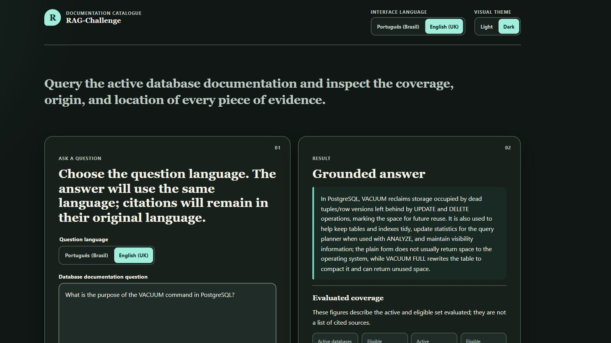
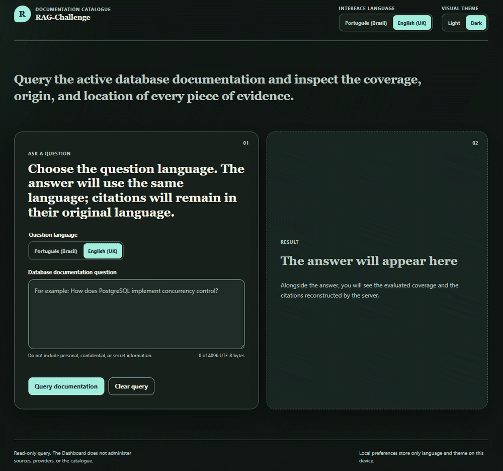
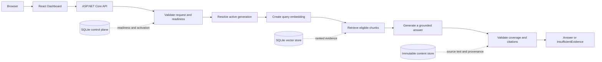

# RAG-Challenge

### Evidence-first retrieval-augmented generation for database documentation

RAG-Challenge turns authorised technical documentation into grounded answers
with evaluated coverage, source provenance and page-level citations.

[**Launch the live demonstration**](https://rag-challenge-ac09.onrender.com/) ·
[OpenAPI v2](docs/api/openapi-v2.json) ·
[OpenAPI v1](docs/api/openapi-v1.json) ·
[MIT License](LICENSE)

[](https://rag-challenge-ac09.onrender.com/)

> [!NOTE]
> The public demonstration runs on Render's free service tier. After a period
> of inactivity, the first request may take about a minute while the service
> starts. The interface is read-only and the active demonstration corpus is
> PostgreSQL 18.4.

## What it does

RAG-Challenge is a full-stack .NET and React application for querying
authorised database documentation. It retrieves evidence from one active,
content-addressed index generation, asks the configured model to answer only
from that evidence, validates the citations and returns one of two explicit
HTTP 200 domain outcomes:

- `Answered` — a grounded answer accompanied by evaluated coverage and
  verifiable citations;
- `InsufficientEvidence` — an explicit refusal when the eligible evidence is
  not sufficient to support an answer.

Validation, rate-limit and operational failures use the separately documented
HTTP 400, 429, 500 and 503 responses.

The current public profile contains one PostgreSQL 18.4 reference document,
split into 3,282 searchable chunks. Every `Answered` response identifies the
document version, page, chunk, evidence language, source trust class,
provenance, active index generation and request correlation identifier.

## See it in action

[](https://rag-challenge-ac09.onrender.com/)

The demonstration above was captured from one live query against the published
service. The question, generated answer, evaluated coverage and citation
metadata are real; no response was mocked or hand-written for this README.

## Key capabilities

| Capability | Behaviour |
| --- | --- |
| Grounded questions | Answers are constrained to retrieved, eligible evidence from the active generation. |
| Verifiable citations | Each citation carries document, version, page, chunk, provenance, language and reproducible technical identifiers. |
| Coverage disclosure | The response reports the active and eligible database and document counts evaluated for the request. |
| Fail-closed outcomes | Missing readiness, provider authority, budget or evidence produces a controlled failure instead of a fabricated answer. |
| Bilingual experience | Interface and question language can be selected independently between `en-GB` and `pt-BR`; citations remain in their source language. |
| Accessible presentation | Responsive React Dashboard with keyboard support, semantic regions, light and dark themes, and locally stored visual preferences. |
| Immutable indexing | Validated index generations are activated atomically and identified in every answer. |
| Reproducible ingestion | Authorised PDF and CSV inputs retain rights, provenance, hashes and immutable document-version identities. |

## How a question becomes an answer



The Domain and Application layers own the rules and ports. Infrastructure
implements parsing, persistence, retrieval and provider adapters; the API host
composes those implementations and serves the built Dashboard from the same
origin.

## Architecture and technology

| Area | Implementation |
| --- | --- |
| Front end | React 18.3, TypeScript 5.7 and Vite 8.1 |
| API and host | ASP.NET Core on .NET 10 |
| Core design | Modular monolith with inward-facing Domain and Application dependencies |
| Ingestion | PDF through PdfPig and CSV through CsvHelper |
| Retrieval | `text-embedding-3-small`, 1,536-dimensional embeddings and deterministic `retrieval-v2` ranking |
| Generation | OpenAI grounded generation with citation reconstruction and validation |
| Persistence | SQLite control plane and vector store plus an immutable content store |
| Contracts | Versioned OpenAPI v1 and v2 documents |
| Delivery | Non-root container, public GHCR package and Render Web Service |

### Public demonstration profile

| Item | Active value |
| --- | --- |
| Logical corpus | `rag-challenge-product` |
| Documentation | PostgreSQL 18.4, authorised local PDF |
| Search index | 3,282 chunks and vectors |
| Embedding model | `text-embedding-3-small` at 1,536 dimensions |
| Generation model | `gpt-5.4-mini-2026-03-17` |
| Hosting | Render free Web Service |
| Runtime state | Ephemeral store restored from a verified seed at start-up |

## API

The Dashboard uses the same public v2 contract exposed by the server:

```http
POST /api/v2/questions
Content-Type: application/json
```

```json
{
  "corpusId": "rag-challenge-product",
  "questionLanguage": "en-GB",
  "question": "What is the purpose of the VACUUM command in PostgreSQL?"
}
```

The response contains the outcome, answer, evaluated coverage, citations,
active generation and correlation identifier. See the complete schemas and
failure responses in [OpenAPI v2](docs/api/openapi-v2.json). The legacy
readiness and compatibility surface remains documented in
[OpenAPI v1](docs/api/openapi-v1.json).

## Run the project checks locally

### Prerequisites

- .NET SDK `10.0.302` or its latest compatible patch, as defined by
  [`global.json`](global.json);
- Node.js `>=24.18.0 <25` and npm `>=11.16.0 <12`;
- PowerShell 7.

### Restore dependencies

```powershell
dotnet restore RAG-Challenge.sln --locked-mode

Push-Location src/RagChallenge.Dashboard.Web
npm ci --ignore-scripts --no-audit --no-fund
Pop-Location
```

### Execute the complete quality gate

```powershell
./eng/ci.ps1
```

The online gate performs locked restores, formatting checks, Release builds,
.NET unit, architecture and integration tests, front-end linting, type
checking, tests and production build, coverage enforcement, dependency
auditing, common committed-secret assignment checks, link validation and
Render boundary checks. The current minimum coverage thresholds are 70% of
lines and 45% of branches.

With all required dependency caches already populated, the same gate can run
without online restore. Registry-backed .NET and npm vulnerability audits are
reported as `NOT_RUN` in this mode:

```powershell
./eng/ci.ps1 -Offline
```

### Provider-backed runtime

The public repository does not offer an unauthorised one-command provider
bootstrap. The canonical local host entrypoint,
[`eng/Start-PostgreSql18Product.ps1`](eng/Start-PostgreSql18Product.ps1), is a
fail-closed launcher for an already prepared environment. It requires a
validated local store, approved credential resolution and trusted operational
grants for query embeddings and grounded generation. Generated stores, grants
and credentials remain local and are never committed.

## Deployment model

The free deployment keeps the operational boundary intentionally small:

1. the Dashboard is built and copied into the ASP.NET Core image;
2. the image runs as a non-root user and serves UI and API from one origin;
3. a verified, read-only seed is copied to an ephemeral runtime directory at
   start-up;
4. Render checks `/api/v1/health/ready` before the service is considered ready;
5. the public GHCR image is selected by immutable digest rather than a mutable
   tag.

There is no Render database, persistent disk or private registry credential in
the live free-tier service. Packaging and local verification do not publish or
deploy by themselves:

```powershell
./eng/Build-RenderFreePackage.ps1
./eng/Test-RenderFreePackage.ps1
```

## Security and operational boundaries

- Secrets are resolved at runtime and must never be committed, logged or
  included in screenshots.
- Questions are bounded to 4,096 UTF-8 bytes; requests, responses, deadlines,
  concurrency and rate limits are also enforced.
- Retrieved passages, model output and external content are treated as
  untrusted data.
- Provider admission and aggregate cost are controlled by a durable,
  fail-closed budget envelope.
- The provider transport uses bounded direct HTTPS calls without redirects or
  automatic retries.
- The Dashboard is query-only; catalogue administration and source activation
  are not exposed through the public UI.

## Repository map

```text
RAG-Challenge/
├── src/
│   ├── RagChallenge.Domain/          # Core rules and immutable concepts
│   ├── RagChallenge.Application/     # Use cases and inward-facing ports
│   ├── RagChallenge.Infrastructure/  # Persistence, parsing, retrieval, providers
│   ├── RagChallenge.Server.Api/      # Composition root and HTTP contracts
│   └── RagChallenge.Dashboard.Web/   # React Dashboard
├── tests/                            # Unit, architecture and integration tests
├── docs/api/                         # Versioned OpenAPI contracts
├── docs/evaluation/                  # Deterministic evaluation fixtures and schemas
├── deploy/render-free/               # Free-tier container and Render definition
├── eng/                              # Build, test, packaging and runtime entrypoints
└── corpus/postgresql/18.4/            # Licensed PostgreSQL documentation input
```

Internal agent configuration, governance material, secrets, generated stores,
build output, local evidence and unauthorised source material are intentionally
excluded from the public repository.

## Corpus and licensing

The application source is licensed under the [MIT License](LICENSE). The
PostgreSQL documentation is distributed separately under the PostgreSQL
Licence; its notice, provenance, digest and redistribution boundary are
recorded in
[`corpus/postgresql/18.4/NOTICE.md`](corpus/postgresql/18.4/NOTICE.md).

The PDF is a reproducible source input, not the system of record for the active
runtime store. Oracle documentation and all other unapproved source material
are excluded from this repository.

## Current demonstration scope

- one active logical corpus and one PostgreSQL 18.4 document;
- read-only questions in `en-GB` or `pt-BR`;
- ephemeral free-tier runtime, so cold starts are expected;
- no public catalogue administration, document upload or source activation;
- no claim of production homologation or support for every database product.

The architecture supports governed document versioning and replaceable
adapters, but this README describes only the capabilities active in the public
demonstration.
